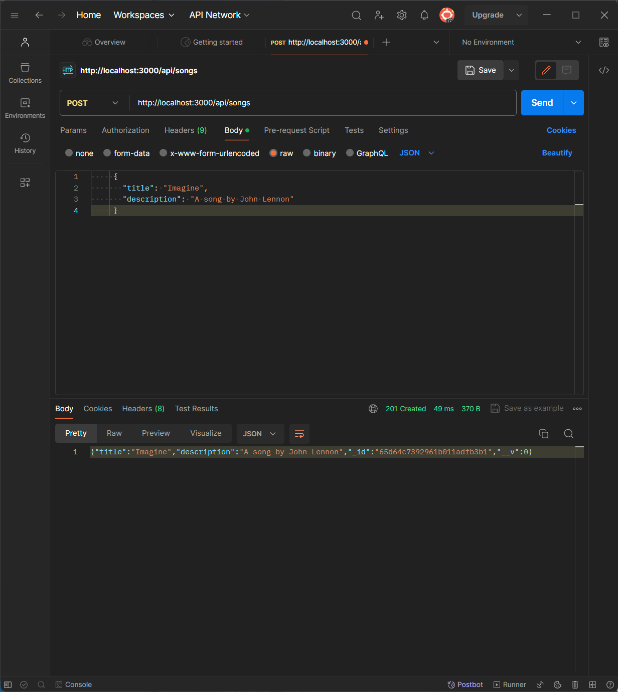

# Renton Technical College CSI-244

<br />

<div align="center">  
    
    <h3 align="center">Guided Activity 6</h3>
</div>

This repository is a part of CSI-244 at Renton Technical College.

## Guided Activity 6 Mongoose, MVC and Rest API

1. Clone this repository to your machine.
2. Open the repository in Visual Studio code.
3. Follow the instructions to create a RESTful API using mongoose and MVC

# Express Mongoose MVC Tutorial

Welcome to this guide on building a backend for a web application using the Model-View-Controller (MVC) architectural pattern with Node.js, Express, MongoDB, and Mongoose. By the end of this tutorial, you will have a clear understanding of how to implement a CRUD (Create, Read, Update, Delete) application using the MVC pattern.

## What is MVC?

MVC stands for Model-View-Controller, a design pattern that helps in organizing code in a way that separates the application's concerns into three interconnected components:

1. **Model**: Represents the data structure, business logic, and manages interactions with the database. We'll use MongoDB for data storage.
2. **View**: Handles the presentation layer for the user. Although we'll focus on the backend, the View would be what the users interact with.
3. **Controller**: Acts as a bridge between the Model and the View, managing user input, business logic, and updates to the model.

# What is Mongoose?

Mongoose is an Object Data Modeling (ODM) library for MongoDB and Node.js. It provides a straightforward schema-based solution to model your application data. Mongoose is built on top of the MongoDB Node.js driver, which means it is a higher-level API that simplifies working with MongoDB. Mongoose allows for us to communicate with a MongoDB database in a way that is more structured and easier to work with than using the MongoDB driver directly. Mongoose also provides a way to define schemas for our data which can help to enforce data integrity and consistency.

[Link to Mongoose documentation](https://mongoosejs.com/docs/)

### Commonly used mongoose methods

- `mongoose.connect()`: Connects to a MongoDB database.
- `mongoose.Schema()`: Defines the structure of the document.
- `mongoose.model()`: Creates a model from a schema.
- `Model.find()`: Retrieves documents from a collection.
- `Model.findById()`: Retrieves a single document by its ID.
- `Model.create()`: Creates a new document.
- `Model.findByIdAndUpdate()`: Updates a document by its ID.
- `Model.findByIdAndDelete()`: Deletes a document by its ID.

# What is a RESTful API?

REST stands for Representational State Transfer, a software architectural style that defines a set of constraints to be used for creating web services. A RESTful API is an API that follows these constraints and is designed to be used over the internet. RESTful APIs are stateless, meaning that each request from a client to the server must contain all the information needed to understand and process the request. RESTful APIs use standard HTTP methods (GET, POST, PUT, DELETE) to perform CRUD operations on resources.

# Part 1: Setting up the Environment

First, ensure Node.js and Mongoose are installed on your machine. Then, set up your project:

```bash
mkdir my-api
cd my-api
npm init -y
npm install express mongoose cors
```

## Setting up connection string

To enhance the security and flexibility of your application, it's a best practice to move sensitive information, such as your database connection string, into environment variables. This can be achieved using a `.env` file in your Node.js project. Here's how to set it up:

### Step 1: Navigate to Mongodb.com, Create a new database called GA6 and a new collection called songs

### Step 2: Install dotenv Package

First, you'll need to install the `dotenv` package, which will load environment variables from a `.env` file into `process.env` in your application. Run the following command in your project directory:

```powershell
npm install dotenv
```

### Step 3: Create a .env File

1. In the root of your project directory, create a file named `.env`.
2. Open the `.env` file in VS Code.
3. Add your MongoDB connection string as an environment variable in the file. For example:

```env
MONGO_URI=YOUR CONNECTION STRING HERE
```

### Step 4: Ensure .env is in Your .gitignore

To prevent sensitive information from being pushed to your Git repository, make sure your `.env` file is listed in your `.gitignore` file. If you don't have a `.gitignore` file, create one in the root of your project, and add the following lines:

```
.env
node_nodules/
```

By moving your MongoDB connection string into an `.env` file and utilizing the `dotenv` package, you enhance the security and configurability of your application, keeping sensitive information out of your codebase.

# Part 2: Building the Application

Create a new file named server.js in the root folder of my-api, and bring in the required dependencies:

```javascript
//bring in our libraries
const express = require("express");
const mongoose = require("mongoose");
const cors = require("cors");
//setup dotenv
require("dotenv").config();
const app = express();
//Port can come from .env or default to 3000
const port = process.env.PORT || 3000;

//add middleware
app.use(cors());
app.use(express.json());
//define endpoints
app.get("/", (req, res) => {
  res.send("Hello World!");
});

app.listen(port, () => {
  console.log(`Server is running on port ${port}`);
});
```

Run your server and verify that it is working by visiting `http://localhost:3000` in your browser. You should see the message "Hello World!" displayed on the screen. You should also see the message "Server is running on port 3000" in your terminal.

```powershell
node server.js
```

If you would like to use nodemon you can install and use that as well.

Shut down the server with `ctrl+c` and let's move on to the next step.

### Step 1: Create the Model

The Model represents the data structure of the application. It is a JavsScript object that will define the schema of the data stored in the MongoDB database. In this case, we will create a Song model with a title and description field.

In `models/song.js`, define the schema and model for songs in our application:

```javascript
const mongoose = require("mongoose");
const songSchema = new mongoose.Schema({
  title: String,
  description: String,
});

const Song = mongoose.model("Song", songSchema);

module.exports = Song;
```

### Step 2: Building a Controller

The Controller is responsible for handling requests. Controllers use the Model to communicate with the database and return responses to the client. Inside of this Controller will be functions that handle each type of operation that our API will need to perform using the Song model.

In `controllers/songController.js`, implement the logic for handling CRUD operations:

```javascript
const Song = require("../models/song");

exports.createSong = async (req, res) => {
  const { title, description } = req.body;
  try {
    const song = new Song({ title, description });
    const savedSong = await song.save();
    res.status(201).json(savedSong);
  } catch (error) {
    res.status(500).json({ error: "An error occurred" });
  }
};

exports.getAllSongs = async (req, res) => {
  try {
    const songs = await Song.find();
    res.json(songs);
  } catch (error) {
    res.status(500).json({ error: "An error occurred" });
  }
};

exports.getSong = async (req, res) => {
  const { id } = req.params;
  try {
    const song = await Song.findById(id);
    if (!song) res.status(404).json({ error: "Song not found" });
    else res.json(song);
  } catch (error) {
    res.status(500).json({ error: "An error occurred" });
  }
};

exports.updateSong = async (req, res) => {
  const { id } = req.params;
  const { title, description } = req.body;
  try {
    const song = await Song.findByIdAndUpdate(
      id,
      { title, description },
      { new: true }
    );
    if (!song) res.status(404).json({ error: "Song not found" });
    else res.json(song);
  } catch (error) {
    res.status(500).json({ error: "An error occurred" });
  }
};

exports.deleteSong = async (req, res) => {
  const { id } = req.params;
  try {
    const song = await Song.findByIdAndDelete(id);
    if (!song) res.status(404).json({ error: "Song not found" });
    else res.json({ message: "Song deleted successfully" });
  } catch (error) {
    res.status(500).json({ error: "An error occurred" });
  }
};
```

### Step 3: Setting Up the Routes

The routes define the endpoints that the client can access. This is similar to what we used to do in server.js with app.get(), app.post(), etc. However as your application grows in complexity it becomes impracticle to keep all of your routes in server.js. By splitting the routes out to seperate files you can keep your code organized and easier to maintain. At this point we only have one controller, one model and one routes file but large applications can have many of each.

Define your application routes in `routes/songRoutes.js`:

```javascript
const express = require("express");
const router = express.Router();
const songController = require("../controllers/songController");

router.post("/songs", songController.createSong);
router.get("/songs", songController.getAllSongs);
router.get("/songs/:id", songController.getSong);
router.put("/songs/:id", songController.updateSong);
router.delete("/songs/:id", songController.deleteSong);

module.exports = router;
```

### Step 4: Initializing Express and MongoDB

Set up Express and connect to MongoDB in `server.js`:

```javascript
const express = require("express");
const mongoose = require("mongoose");
require("dotenv").config();
//bring in the routes
const songRoutes = require("./routes/songRoutes");
const cors = require("cors");
const app = express();
const port = process.env.PORT || 3000;
//use mongoose to connect to the database
mongoose.connect(process.env.MONGO_URI, {
  useNewUrlParser: true,
  useUnifiedTopology: true,
});
//add middleware
app.use(cors());
app.use(express.json());
//associate the songRoutes with the /api endpoint
app.use("/api", songRoutes);

app.listen(port, () => {
  console.log(`Server is running on port ${port}`);
});
```

## Running the Application

Ensure MongoDB is running, then start your application:

```bash
node server.js
```

# Part 3 Connect to your server using Postman

### Testing Endpoints with Postman and Including Screenshots

For the final part of this tutorial, you will test each of the endpoints with Postman to ensure that your Web API is functioning as expected. You will also capture and include screenshots of these tests to document the process.

#### Step 1: Prepare for Testing

1. **Create a Directory for Screenshots**:

   - In your project repository, create a directory where you can save screenshots of your Postman tests. You can do this from your terminal:

     ```powershell
     mkdir screenshots
     ```

2. **Launch Postman**:
   - Open Postman. If you haven't already installed Postman, download it from [the official site](https://www.postman.com/downloads/) and install it. Once it has installed create a free account.

#### Step 2: Test the `POST /api/songs` Endpoint

You're going to test creating a new song by sending a POST request to your API.

1. **Set Up the Request**:

   - In Postman, create a new request by clicking the "New" button and selecting "HTTP".
   - Click "Save" and name your request "Create New Song" and save it to a collection.
   - Set the request type to `POST` and enter the URL for your `api/songs` endpoint, e.g., `http://localhost:3000/api/songs`.

2. **Include Song Information**:

   - In the "Body" tab of your request, select "raw" and then "JSON" from the dropdown menu.
   - Enter the details of the song you want to create. For example:

     ```json
     {
       "title": "Imagine",
       "description": "A song by John Lennon"
     }
     ```

3. **Send the Request**:

   - Click the "Send" button to make the request to your API.

4. **Capture the Response**:
   - After sending the request, you'll receive a response from your API. If the song is successfully created, you should see a `201` status code and the details of the created song in the response body.
   - Capture a screenshot of the Postman window showing both the request and the response. This will include the setup of your request and the successful response from your server.



5. **Save the Screenshot**:
   - Save the screenshot to the `screenshots` directory you created. You might name it `create-new-song-postman.png` to clearly indicate what the screenshot represents.

#### Step 3: Repeat for Other Endpoints

Follow a similar process to test other endpoints (`GET`, `PUT`, `DELETE`) of your API. For each test:

- Set up the request in Postman with the correct HTTP method and URL.
- If necessary, include the required information in the request body or URL parameters.
- Send the request and capture the response.
- Take screenshots of both the request and response, and save them to your `screenshots` directory with descriptive names.

By following these steps, you'll not only ensure that your Web API is functioning correctly but also create a visual record of your API's capabilities and how to interact with it. This can be incredibly useful for both your reference and when sharing your project with others.

If you have any questions about this assignment please reach out to myself or our TA for this course.
